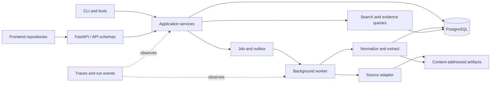

# Backend Architecture

**Status:** controlling Phase 0 implementation direction
**Updated:** 2026-09-01

## Decision

Contour begins as a Python modular monolith with FastAPI, PostgreSQL, and a small durable background worker. Frontend applications live in separate repositories and communicate through versioned HTTP and event/progress contracts.

One deployable may run the API and worker as separate processes, but correctness must not depend on shared process memory. PostgreSQL and content-addressed artifacts hold durable state.



## Architectural rules

1. Domain semantics do not import FastAPI, database clients, provider SDKs, or frontend types.
2. Application services own use-case orchestration and transaction boundaries.
3. API routes validate and translate; they do not contain business rules or query repositories directly.
4. PostgreSQL is the initial operational authority and lexical-search implementation.
5. Raw and large derived artifacts use content addressing; metadata and integrity references live in PostgreSQL.
6. Jobs, retries, cancellation, stages, failures, outputs, and metrics share one observable run lifecycle.
7. Serving indexes and caches are disposable projections rebuildable from authoritative records and artifacts.
8. Vendor-specific types remain inside infrastructure.
9. Simple deterministic implementations remain the reference until measurement justifies a replacement.

## Accepted package boundaries

Contour organizes the modular monolith by architectural boundary first and by
product capability inside that boundary. These ownership and dependency rules
are stable even while new capabilities are added:

| Package | Owns | Must not own |
|---|---|---|
| `domain` | identifiers, entities, relationships, evidence, versions, jobs/runs, invariants | HTTP, SQL, provider, or UI details |
| `services` | use cases, commands/queries/results, transaction intent, and safe operational errors organized by capability | framework sessions, SQL, provider payloads, or HTTP semantics |
| `repositories` | capability-specific persistence ports and unit-of-work contracts consumed by services | SQLAlchemy, driver types, SQL, generic CRUD bases, or transport behavior |
| `api` | FastAPI schemas, HTTP authentication extraction, validation, error/status translation, signed cursors, and versioning | business rules, durable idempotency policy, or direct persistence |
| `worker` *(when implemented)* | durable-job delivery, polling, cancellation handling, and service-error translation | extraction policy, SQL, or in-memory job authority |
| `infrastructure/<technology>` | PostgreSQL, artifact, source, and provider implementations of repository or service ports | durable domain semantics or use-case policy |
| `observability` | logging, metrics, tracing setup, redaction integration, and telemetry adapters | product decisions or request orchestration |
| `evaluate` *(when implemented)* | fixtures, metrics, regression identity, and run comparison | product truth based only on model judges |
| `bootstrap` | executable composition roots, dependency construction, and process lifetimes | business rules or runtime dependency lookup from core code |
| `settings.py` | validated process configuration values and startup configuration failures | service behavior, provider calls, or resource construction |

Source-specific acquisition belongs in infrastructure such as
`infrastructure/source/pep.py`; its durable orchestration belongs in a
capability-named service such as `services/source_persistence.py`. PostgreSQL
search, catalog,
knowledge, and execution code remain peer capabilities below
`infrastructure/postgres/`. The repository does not create these modules before
the corresponding behavior exists.

The automated architecture checks enforce the current dependency directions
and reject ambiguous catch-all module names, SQL inside services or repository
ports, and direct persistence access from API routes.

## Code organization and request flow

Contour uses ports-and-adapters dependency rules with conventionally named
layers. Names such as controller, service, repository, model, and DTO describe
responsibilities; they do not require a generic framework base class.

```text
HTTP request
  -> api route/controller + Pydantic request schema
  -> service + framework-neutral command/query value
  -> capability-specific repository or service port
  -> PostgreSQL/source/artifact infrastructure
  -> service result
  -> api Pydantic response schema
```

The implemented layout applies that flow as follows:

```text
src/contour/
  domain/                         one module per domain concept and its identity
  services/
    error.py                      shared service-error base only
    health_service.py             framework-neutral health use cases
    access_service.py             membership-backed Tenant access
    catalog_collections.py        authenticated Tenant/Workspace/Source use cases
    catalog_service.py            atomic catalog admission use case
    catalog_errors.py             safe catalog and operation-replay failures
    knowledge_persistence.py      atomic Entity/Relationship admission
    execution_persistence.py      atomic Job/Run recording
    resource_errors.py            non-enumerating inaccessible-resource outcome
    source_persistence.py         artifact-first immutable source admission
  repositories/
    artifact.py                    exact content-addressed artifact port
    workspace.py                  workspace persistence port
    source.py                     logical-source persistence port
    source_version.py             immutable-version persistence port
    evidence.py                   exact-evidence persistence port
    catalog_transaction.py        atomic catalog unit-of-work contract
    knowledge_transaction.py      narrow Entity/Relationship transaction view
    execution_transaction.py      narrow Job/Run transaction view
  infrastructure/
    artifact/
      filesystem.py               atomic SHA-256 filesystem artifacts
    authentication/
      static_credentials.py       configured local/demo credential adapter
    source/
      pep.py                      reference PEP preflight and acquisition
    postgres/
      engine.py                   process-scoped engine and pool policy
      readiness.py                PostgreSQL health implementation
      tables/
        metadata.py               shared SQLAlchemy metadata registry
        catalog.py                catalog/evidence table definitions
        registry.py               assembled head-schema metadata
      catalog_transaction.py      atomic PostgreSQL unit of work
      workspace_repository.py     workspace queries and row mapping
      source_repository.py        source queries and row mapping
      source_version_repository.py version queries and row mapping
      evidence_repository.py      evidence queries and row mapping
  api/
    authentication.py             HTTP-owned credential verification port
    cursor.py                     signed scope-bound HTTP pagination tokens
    routes/catalog.py             thin authenticated catalog controllers
    schemas/catalog.py            Pydantic-only catalog wire contracts
    error_handler.py              service-error to HTTP translation
    app.py                        HTTP delivery assembly
  bootstrap/
    http.py                       HTTP composition and process lifetimes
  observability/
    logging.py                    logging configuration and secret redaction
  settings.py                     validated process configuration
```

This conventional layout is deliberately literal: developers find orchestration
under `services/`, persistence interfaces under `repositories/`, business
meaning under `domain/`, HTTP contracts under `api/`, and external-system code
under `infrastructure/`. Each file remains capability-specific, so the familiar
layer names do not become generic dumping grounds.

Contour does not add a separate `db/` package because engine, connection, table,
and transaction behavior is currently PostgreSQL-specific and already has one
clear owner under `infrastructure/postgres/`. If a technology-neutral database
responsibility emerges, it can be extracted with evidence rather than duplicated
in anticipation.

### Architecture stability and change admission

This package topology is an accepted baseline. New work follows the
[feature startup and architecture stability protocol](../development/feature-startup.md)
and places behavior in these owners before considering another layout. A
repository-wide layer-first versus feature-first reshuffle is not ordinary
feature work.

A boundary moves only for a demonstrated forbidden dependency, mixed ownership,
duplicate implementation path, real second adapter or implementation that the
contract cannot support, measured operational failure, or accepted change to
deployment or consistency. Line count alone, file count, preference, fashion,
and hypothetical scale do not admit an architecture change. An admitted change
updates implementation, callers, tests, composition, generated contracts, and
documentation together; removes the replaced path; and adds the smallest
executable architecture check that prevents recurrence. The result must leave
one vocabulary and one obvious implementation path.

### Dependency direction

| Importing code | May depend on | Must not depend on |
|---|---|---|
| `domain` | standard library and other domain concepts | services, repositories, infrastructure, delivery, settings, observability, or third-party frameworks |
| `repositories` | domain and other capability-specific repository contracts | services, infrastructure, delivery, settings, observability, database/provider libraries |
| `services` | domain and repository or provider ports | infrastructure, delivery, settings, observability, database/provider libraries |
| `infrastructure` | domain, repository/service contracts, settings, and technology libraries | API, worker delivery, or bootstrap |
| `api` and future `worker` | service contracts, domain values needed for translation, and delivery libraries | repositories, concrete infrastructure, or bootstrap |
| `observability` | standard library and telemetry libraries | domain or service policy, repositories, infrastructure, delivery, or bootstrap |
| `settings.py` | standard library | core policy, infrastructure, delivery frameworks, or database clients |
| `bootstrap` | any package required to construct one executable | business rules or service-locator access from inward packages |

Services may use another capability's explicit public contract when a real
workflow coordinates them. They must not reach into private helpers or form
circular imports. The composition root is the only ordinary location that
imports both a delivery adapter and concrete infrastructure.

### Decision evidence and evolution

The requirement is to add API, worker, ingestion, knowledge, and search behavior
without letting framework, provider, or database concerns become service or
domain policy. Capability-colocated application/adapter packages were the prior
sound alternative. The conventional layer names were selected because they
preserve the same dependency direction while making the first navigation step
immediately recognizable to FastAPI developers.

This structure adds no deployment boundary and no runtime framework. Its main
failure risk is ceremonial fragmentation, controlled by creating packages only
for implemented behavior and splitting modules only for distinct reasons to
change. Its main security and reliability benefit is that untrusted transport
input, bound database values, safe service errors, transaction scopes, and
secret-aware observability each have an explicit owner.

The refactor changes internal Python import paths but not the HTTP contract,
database schema, migration history, transaction behavior, or deployment shape.
Rollback therefore restores the prior package names without a data migration.
Because the package is pre-release and has no declared third-party Python API,
compatibility is enforced at the HTTP, persistence, and migration boundaries
rather than through temporary internal import shims.

Modules can be collapsed if their responsibilities disappear, and concrete
infrastructure can be replaced by implementing the capability-specific ports;
no domain migration is required for either change. The layer packages should be
renamed or reorganized again if they become dumping grounds. A separate
distribution, deployable service, DI container, ORM-domain model, or specialized
datastore still needs a new workload and admission evidence. Import-direction
tests, schema-drift checks, API contracts, and real PostgreSQL transaction tests
verify the current decision.

### Namespace and distribution boundary

`src` is the source root, not a second application namespace. Phase 0 ships one
Python distribution and one top-level import package, `contour`; the HTTP
adapter therefore lives at `contour.api`, alongside future peers such as
`contour.cli` or `contour.mcp`. Do not create a generic top-level `api` package
or a second `contour.core` catch-all. Split a delivery adapter into another
distribution only when it has a real independent versioning, ownership, reuse,
or deployment boundary with its own project metadata.

Name each production module for one clear domain or service concept in
`snake_case`: `workspace.py`, `source.py`, and `source_version.py`, for example.
Keep an aggregate/value object with inseparable identity types in its concept
module—`Workspace` with `WorkspaceId`, and `SourceVersion` with
`SourceVersionId` and `ContentDigest`. Split unrelated public classes into their
own concept-named modules; private helpers that serve only one concept may remain
there. Keep package-wide constants, type aliases, and validation helpers in one
clearly named shared module within the owning package. Use a capability
subpackage when it makes related concepts easier to discover. Preserve stable
package-level public imports only for an intentional facade. Capability
`__init__.py` files may expose stable domain or service contracts, and
`bootstrap/__init__.py` may preserve executable entrypoints; layer packages and
concrete infrastructure packages remain free of implementation re-exports so
imports show the actual owner. `services/`, `repositories/`, and
`infrastructure/` are accepted layer names with strict ownership; their modules
must still be capability-specific. Do not create ambiguous catch-all modules or
packages named `common`, `core`, `helpers`, `models`, or `utils`. Do not create
empty architectural directories in anticipation of growth. FastAPI routers are
Contour's HTTP controllers.
Server-rendered views are not part of this backend.

Promote a cohesive module to a capability package when it has at least two
independent responsibilities with different reasons to change, or when a real
delivery/infrastructure boundary requires separate ports and implementations.
Split by concept or use case, not by class count. Roughly 400 handwritten lines
remains a review signal rather than an automatic split rule.

HTTP, a future CLI, a future MCP server, workers, and tests are peer delivery
adapters. They may translate their own inputs and outputs, but they invoke the
same services. Services never call routes, parse HTTP requests, emit CLI text,
or depend on MCP/FastAPI types.

## Model and DTO ownership

One class must not serve all layers merely because the fields initially match:

| Type | Location and representation | Purpose |
|---|---|---|
| Domain model | `domain`; plain typed Python value/entity objects | identity, state, and knowledge invariants |
| Service command/query/result | `services`; plain dataclasses or typed values when a separate representation is justified | transport-neutral use-case input and output |
| API schema | `api/schemas`; Pydantic models | untrusted HTTP validation, serialization, and OpenAPI |
| Persistence model | `infrastructure/postgres/tables`; SQLAlchemy Core tables | SQL schema and database mapping details |

Translate explicitly at a boundary. Reuse an immutable value object across
domain and services only when it retains exactly the same semantics; never
make domain behavior depend on Pydantic, SQLAlchemy, or FastAPI. Migration files
remain the durable schema history and must not import API models.

Repository ports expose behavior needed by a use case or aggregate, such as
`get_workspace` or `add_source_version`; they are not generic CRUD base classes.
PostgreSQL implementations, query expressions, table mappings, and row conversion
remain in infrastructure. Services own transaction intent.

The implemented catalog slice uses one focused repository port each for
workspaces, logical sources, immutable source versions, and evidence locators.
Its PostgreSQL transaction implementation is a factory for
request/command-scoped units of work; each unit checks out one pooled connection,
composes those repositories, and commits or rolls back atomically. Runtime
queries use SQLAlchemy Core tables
and bound expressions rather than duplicated SQL strings or ORM-backed domain
models. Persistence failures are translated at the infrastructure boundary into
stable, safe service errors. A replacement persistence technology therefore
implements the same behavior-focused ports without changing domain objects or
the catalog service. Do not introduce generic repository bases or
factories that construct arbitrary domain objects: explicit constructor wiring
at `bootstrap` is the simpler composition pattern until a real additional
runtime needs a fresh scoped resource.

### Persistence implementation policy

SQLAlchemy Core is the default runtime query API because it is already required
by Alembic, preserves explicit domain models, binds values safely, and provides
one schema vocabulary for queries and migration-drift checks. Contour does not
use ORM entities as domain objects. A handwritten SQL statement is allowed only
when PostgreSQL behavior cannot be expressed clearly or efficiently with Core;
it must stay inside PostgreSQL infrastructure, bind every untrusted value,
whitelist any dynamic identifier or ordering token, document why Core was
insufficient, and receive an integration or benchmark check appropriate to its
risk.

Migration revisions remain immutable schema history. SQLAlchemy metadata models
the expected head schema, and the isolated migration integration check rejects
drift between the two. Repository methods select only fields needed for their
domain mapping, important use cases document query count and transaction scope,
and performance work requires an observed workload rather than speculative
caching or denormalization.

Alembic revisions are the only mechanism that changes a durable Contour schema.
The SQLAlchemy Core metadata registry is descriptive input for query construction,
autogeneration, and head-schema comparison; it is not a runtime schema
synchronizer. API and worker startup must never call `MetaData.create_all()`,
`MetaData.drop_all()`, run `alembic upgrade`, or otherwise mutate schema as a
lifespan side effect. A release process applies `alembic upgrade head` as a
separate observable step before starting code that requires the new schema.
Production deployment orchestration is not implemented yet, so no current
runtime claims to perform that step.

Autogenerated revisions are drafts, not authority. Every schema change is
reviewed for names, types, nullability, constraints, indexes, defaults, data
movement, lock impact, and recovery behavior, then exercised from the tracked
baseline on an isolated PostgreSQL database. Renames and data migrations are
authored explicitly. Non-additive changes use an expand/backfill/verify/contract
sequence when overlapping application versions need compatibility; a destructive
rebuild is never a production recovery strategy.

## Dependency wiring and lifetimes

Use explicit constructor or function injection and assemble the object graph in
`bootstrap/<executable>.py`. This is dependency injection without a runtime DI
framework: dependencies are visible to type checking and tests, construction
failures happen at startup, and core packages contain no global service lookup.

- Stateless services and immutable configuration may be built once
  per process and shared.
- Connection pools, clients, and worker resources are created and closed by an
  explicit executable lifespan or context manager.
- Database sessions, transactions, authorization contexts, and request metadata
  are scoped to one request, command, or job; they are never process singletons.
- Factories are injected when a use case needs a fresh scoped resource.
- A dependency registry may be used only at a delivery/composition boundary;
  service and domain code must declare their direct dependencies instead of
  pulling them from a service locator.

FastAPI's dependency mechanism may adapt HTTP request-scoped values, but it is
not the owner of domain or service construction. Adopt a third-party DI
container only if the real graph develops multiple scopes, conditional bindings,
or plugin wiring that manual composition can no longer keep clear. Record the
need, lifecycle and cleanup behavior, simpler alternative, test evidence, and a
removal path before adding that dependency. Singleton support alone is not a
reason to add a container.

The HTTP composition root currently creates one SQLAlchemy engine and connection
pool, PostgreSQL transaction manager, configured static credential adapter, and
application services for the process. It injects the HTTP-owned credential port
and services into FastAPI and disposes the engine through lifespan handling.
Concrete authentication and PostgreSQL adapters are imported only by
infrastructure and bootstrap; an executable architecture test enforces that
core and delivery code cannot bypass those boundaries. This is ordinary
constructor injection, so a third-party DI container remains unjustified.

## Data ownership

PostgreSQL is authoritative for Tenant and Membership state, tenant-owned
Workspace and Source metadata, immutable Version manifests, Evidence locators,
basic Entities and Relationships, Job/Run state, search documents, and
audit/security metadata appropriate to the current deployment.

Tenant is the durable ownership and security boundary; Workspace is a context
partition inside exactly one Tenant. The implemented PostgreSQL schema stores a
non-null Tenant and Workspace tuple on every catalog, knowledge, and execution
record. Composite foreign keys bind sources, immutable versions, evidence,
evidence attachments, relationship endpoints, jobs, and runs to that same
tuple, so cross-owner associations fail atomically even for otherwise valid
identifiers. Principals and Memberships are durable PostgreSQL records.
Catalog services derive a verified Access Context from Membership, then carry
its Tenant scope through Workspace, catalog, knowledge, execution, and
artifact-facing operations. A selector is never accepted as access proof.

Artifact storage is authoritative for acquired bytes, large normalized artifacts, extraction/evaluation outputs, and reproducibility manifests. Every artifact reference includes an integrity digest.

The implemented raw PEP persistence path writes and verifies exact admitted
bytes through the artifact port before admitting their source-version manifest
in PostgreSQL. A failed artifact operation therefore creates no manifest. A
failed database operation may leave a valid content-addressed orphan, which the
same request can reuse safely on retry. Missing and checksum-invalid filesystem
artifacts remain explicit; resubmitting the already validated bytes repairs
them atomically before the immutable manifest is returned.

Workspace-local Source registration is uniquely identified by Workspace,
Connector kind, and canonical locator. PostgreSQL enforces that invariant so a
concurrent request cannot bypass the application pre-check. Durable operation
replay records are scoped by Principal, ownership scope, operation, and key and
commit in the same catalog transaction as their mutation. A concurrent loser
reads and validates the committed winner; a different payload receives the
stable idempotency-conflict outcome.

The [knowledge model](knowledge-model.md) controls meaning independently of physical tables.

## Initial service contracts

- authenticate a Principal and derive verified Access Context;
- create and list accessible Tenants with initial Membership;
- create, list, and get Workspaces inside the verified Tenant;
- validate, add, list, and get sources;
- start, cancel, and retry ingestion;
- poll or stream job/run progress;
- search admitted content and entities;
- list and get an entity and its basic relationships;
- get evidence and its immutable source version; and
- inspect the run and transformation chain that produced a record.

HTTP handlers, workers, CLI commands, and tests call the same services. API contracts must be usable without importing Python internals so frontend repositories can generate or maintain independent clients.

## Error ownership

- Domain constructors and transitions raise `TypeError` or `ValueError` for
  programmer misuse or invalid domain values before persistence.
- Each service capability owns safe, transport-neutral operational errors
  derived from the shared `ApplicationError` contract.
- HTTP authentication failure belongs to `api/authentication.py` because bearer
  extraction and credential representation are delivery concerns; verified
  `Principal` and `AccessContext` values are transport-neutral domain values.
- Infrastructure translates driver/provider exceptions at its boundary; service
  and delivery code never branch on SQLAlchemy, psycopg, or provider exceptions.
- Delivery adapters map safe service errors to protocol status and envelopes
  without serializing exception causes, statements, credentials, or payloads.
- `ConfigurationError` belongs to `settings.py` and fails executable startup;
  it is not an HTTP service error because no valid application exists yet.

## Failure and trust model

Phase 0 handles source preflight failure, timeout, duplicate requests, partial-
stage failure, cancellation, retry, worker interruption, corrupt artifacts,
checksum mismatch, empty results, unsupported capabilities, invalid credentials
or sessions, permission denial, guessed foreign IDs, and tenant-scope mismatch
in cursors, idempotency, relationships, evidence, jobs, runs, and artifacts.

Accepted work survives a failed stage. Retries are idempotent or create an explicit new attempt. Errors and traces redact secrets and never turn a failure into an unexplained empty result.

## Transaction ownership

Application services decide when work must be atomic; PostgreSQL infrastructure
owns connection checkout, commit, rollback, isolation behavior, cleanup, and
driver-error translation. `CatalogTransactionManager` creates a fresh
request/command-scoped unit of work for Tenant, Principal, Membership,
Workspace, Source, immutable Version, Evidence, and operation-replay changes.
Those repositories share one connection only when a catalog workflow requires
one commit. Knowledge and execution services depend on separate narrow
transaction contracts, so neither use case can reach repositories owned by the
other. PostgreSQL currently satisfies both views with one record-transaction
implementation to share connection, rollback, cleanup, and error translation
mechanics without exposing the broader implementation to application code.
Neither domain objects nor HTTP routes open transactions, and repository methods
never commit independently.

## Acceptance gate

From a clean environment, the backend must start, migrate an empty database,
authenticate a Principal, create/select its Tenant and sample Workspace, ingest
the supported Source, survive and recover from a worker interruption, find a
known Entity, resolve it to exact Evidence and a Version, expose its producing
Run, deny the same path to a second Principal/Tenant without enumeration, and
reproduce the declared checks in CI.
