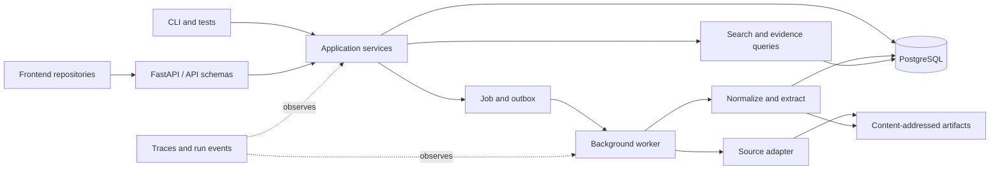

# Backend Architecture

**Status:** controlling Phase 0 implementation direction
**Updated:** 2026-09-06

## Decision

Contour begins as a Python modular monolith with FastAPI, PostgreSQL, and a small durable background worker. Frontend applications live in separate repositories and communicate through versioned HTTP and event/progress contracts.

One deployable may run the API and worker as separate processes, but correctness must not depend on shared process memory. PostgreSQL and content-addressed artifacts hold durable state.



## Architectural rules

1. Domain semantics do not import FastAPI, database clients, provider SDKs, or frontend types.
2. Application services own use-case orchestration and transaction boundaries.
3. API routes validate and translate; they do not contain business rules or query repositories directly.
4. PostgreSQL is the initial operational authority and lexical-search implementation.
5. Raw and large derived artifacts use content addressing; metadata and integrity references live in PostgreSQL.
6. Jobs, retries, cancellation, stages, failures, outputs, and metrics share one observable run lifecycle.
7. Serving indexes and caches are disposable projections rebuildable from authoritative records and artifacts.
8. Vendor-specific types remain inside infrastructure.
9. Simple deterministic implementations remain the reference until measurement justifies a replacement.

## Capability ownership

Contour is organized first by business capability, not by a flat global domain,
services, and repositories taxonomy. The former global `domain/`, `services/`,
and `repositories/` paths, plus the transitional `delivery/http/` path, are
removed; no compatibility imports are retained. Each implemented capability
owns its domain values and application use cases together:

```text
tenancy/          tenant identity, principals, memberships, and verified access
workspaces/       tenant-owned workspace values and use cases
sources/          registration, acquisition, versions, and artifact admission
knowledge/        entities, relationships, and exact evidence records
jobs/             durable jobs and run attempts
api/             FastAPI parsing, schemas, authentication, cursors, and responses
infrastructure/   PostgreSQL, filesystem, source, and credential implementations
workflows/        explicitly atomic cross-capability application workflows
errors/           stable cross-capability application errors
idempotency.py    shared durable replay contract and canonical request digest
identifiers.py    namespaced identity and digest validation
time.py           explicit-unknown temporal value
validation.py     generic framework-independent validation
api/health.py     health endpoint service and readiness contract
composition/      executable dependency composition
```

Application persistence contracts live beside the capability that consumes
them. PostgreSQL modules are concrete implementations only. HTTP invokes
capability use cases and never concrete infrastructure. This change was
admitted because the prior global catalog and records transactions combined
separate tenancy/workspace/source and knowledge/execution responsibilities;
the external HTTP contract, migrations, and data invariants remain unchanged.

### API controller pattern

`api/` is the single FastAPI delivery layer. It follows a controller-and-wire-
contract pattern rather than MVC: route functions parse HTTP input, obtain an
authenticated principal, call a capability use case, and map its result to a
Pydantic response schema. Domain models remain in their owning capability;
creating API "models" would duplicate business meaning and validation.

`api/app.py` assembles the middleware, route registry, and error translation.
The route registry receives one immutable `ApiDependencies` bundle containing
the already-constructed use cases, credential verifier, and cursor codec.
`composition/http.py` is the only place that builds that bundle and the
process-scoped infrastructure. This keeps the application entrypoint small,
maps every public version through `api/routers/` and keeps
dependency construction visible without a DI container or service locator.

`api/middleware.py` owns transport-wide request context. The current middleware
propagates a bounded correlation ID through `Request.state` and the response
header without buffering request bodies or creating request-scoped services.

## Code organization and request flow

```text
HTTP request
  -> api/middleware.py -> api/routers/__init__.py
  -> api/routers/v1/<resource>.py + api/schemas/v1/<resource>.py
  -> <capability>/application/<use_case>.py
  -> <capability>/application/ports.py
  -> infrastructure/postgres/<capability>_transaction.py
  -> capability repositories on one connection
  -> domain result -> HTTP response
```

The implemented layout has one vocabulary:

```text
src/contour/
  tenancy/
    domain/                       tenants, principals, membership and access values
    application/
      access.py                   bootstrap and verify tenant access
      collections.py              authenticated creation, listing and replay
      ports.py                    tenant/principal/membership repositories and transaction
  workspaces/
    domain/workspace.py
    application/
      collections.py              tenant-scoped workspace creation, listing and replay
      ports.py                    workspace repository and transaction
  sources/
    domain/                       sources, immutable versions and exact acquired bytes
    application/
      collections.py              workspace-scoped registration, listing and private replay reconstruction
      persistence.py              artifact-first immutable version admission
      ports.py                    source/version repositories, workspace lookup and transaction
      artifact_store.py           exact content-addressed artifact contract
      errors.py                   registration and connector admission errors
      artifact_errors.py          artifact failure contract
  knowledge/
    domain/                       evidence, entities and relationships
    application/
      persistence.py              atomic evidence-backed assertions
      ports.py                    knowledge repositories and transaction
  jobs/
    domain/                       durable jobs and run attempts
    application/
      persistence.py              atomic job/run recording
      ports.py                    execution repositories and transaction
  workflows/
    source_admission.py           atomic workspace/source/version/evidence admission
  api/
    routers/__init__.py             complete HTTP route registry
    routers/health.py               unversioned process health endpoints
    routers/v1/router.py            version one product route registry
    routers/v1/{tenants,workspaces,sources}.py
    schemas/v1/{tenants,workspaces,sources}.py
    authentication.py             credential verification and bearer extraction
    request_scope.py              non-enumerating route IDs and correlation identity
    cursor.py                     signed scope-bound pagination
    error_handler.py              safe errors to HTTP status/envelope
    app.py                        router assembly
  infrastructure/
    postgres/
      {tenant,workspace,source,knowledge,job}_transaction.py
      source_admission_transaction.py
      transaction_scope.py        connection, commit, rollback and error translation
      *_repository.py             explicit Core queries and domain row mapping
      tables/
        tenancy.py                tenants, principals, memberships and replay records
        catalog.py                workspaces, sources, versions and evidence
        knowledge.py              entities/relationships and evidence attachments
        execution.py              jobs and runs
        registry.py               complete metadata assembly for migrations
    artifact/filesystem.py        atomic content-addressed bytes
    authentication/static_credentials.py
    source/
      pep.py                      cohesive PEP preflight, acquisition and safe errors
      pep_fixture.py              pinned offline content implementation
  composition/http.py             concrete dependencies and pool lifetime
```

A transaction contract specifies an atomic operation, not an extra persistence
layer. Repository protocols express the queries and mutations the operation
needs; concrete adapters implement those protocols directly. Small repository
protocols live together in the capability's `ports.py`, rather than being
forwarded through separate store modules. Artifact storage remains separate
because its integrity and lifetime differ from a PostgreSQL transaction.

Within a capability's `application/` package, name a use-case module for the
operation family its service owns. A `*CollectionService` belongs in
`collections.py`; an `*AccessService` belongs in `access.py`; and a
`*PersistenceService` belongs in `persistence.py`. `ports.py` remains the sole
home for the capability's behavior-focused protocols. The capability directory
supplies the subject, so do not repeat it in every module name. Rename callers,
tests, documentation, and architecture checks together; do not retain
compatibility imports for replaced internal module names.

### Architecture stability and change admission

This package topology is an accepted baseline. New work follows the
[feature startup and architecture stability protocol](../development/feature-startup.md)
and places behavior in these owners before considering another layout. A
repository-wide layer-first versus feature-first reshuffle is not ordinary
feature work.

A boundary moves only for a demonstrated forbidden dependency, mixed ownership,
duplicate implementation path, real second adapter or implementation that the
contract cannot support, measured operational failure, or accepted change to
deployment or consistency. Line count alone, file count, preference, fashion,
and hypothetical scale do not admit an architecture change. An admitted change
updates implementation, callers, tests, composition, generated contracts, and
documentation together; removes the replaced path; and adds the smallest
executable architecture check that prevents recurrence. The result must leave
one vocabulary and one obvious implementation path.

### Dependency direction

| Importing code | Allowed dependencies | Forbidden dependencies |
|---|---|---|
| Capability domain | standard library, explicit domain values, identity/time validation | application, capability service facades, HTTP, infrastructure, runtime settings |
| Capability application | its domain and ports, explicit other-capability domain values, shared safe errors/replay | other capabilities' application internals, workflows, HTTP, concrete infrastructure |
| Workflows | explicit capability ports, domain values and use cases needed by the workflow | HTTP, concrete infrastructure |
| API | application use cases and domain values needed for translation | repository ports, SQL, concrete infrastructure, composition |
| Infrastructure | domain, consuming ports/workflows, configuration and technology libraries | API and composition |
| Composition | concrete adapters, use cases and delivery assembly | business policy |

Cross-capability ownership is explicit. Source registration consumes its own
read-only `WorkspaceLookup` port to verify a nested workspace on the same
connection as registration. It does not import workspace or tenancy application
internals. All scoped operations receive `AccessContext`; HTTP tenant selection
calls tenancy's public access use case before invoking workspace/source behavior.

The one existing workflow that writes across capabilities lives in
`workflows/source_admission.py`. Its four-repository contract is specific to
atomic workspace/source/version/evidence admission. It does not expose tenant,
principal, membership, or replay mutation. Composition and infrastructure may
import that contract; capability application code may not import workflows.

### Decision evidence and evolution

The previous tenancy-owned catalog transaction exposed eight repositories to
every collection use case. That made source and workspace application code
depend on tenancy internals and made tenancy depend on source-owned replay and
error contracts. Moving the same broad object to another folder would retain
those dependencies. Narrow capability transaction contracts remove them;
the existing cross-capability admission has its own workflow contract.

No database revision, dependency, public route, error code, replay namespace,
request fingerprint, or serialization format changes with this organization.
Each transaction still owns one pooled connection. Mutation and idempotency
record remain atomic; a conflicting concurrent transaction reads the committed
winner in a fresh transaction. Catalog error translation retains its existing
wire vocabulary separately from knowledge/execution errors.

Verification covers actual capability imports, cross-capability application
imports, API/persistence separation, rollback, tenant ownership, immutable
artifacts, the populated migration path and metadata drift, and exact generated
OpenAPI equality. A composed HTTP/database test checks creation, replay,
different-payload conflict, and rollback when replay storage fails across the
three collection boundaries. Removal of the broad contract is complete; no
compatibility facade remains. Reverting this structural change requires a
coherent code revert, not a data migration.

### Namespace and distribution boundary

`src` is the source root, not a second application namespace. Phase 0 ships one
Python distribution and one top-level import package, `contour`; the HTTP
adapter therefore lives at `contour.api`, alongside future peers such as
`contour.cli` or `contour.mcp`. Do not create a generic top-level `api` package
or a second `contour.core` catch-all. Split a delivery adapter into another
distribution only when it has a real independent versioning, ownership, reuse,
or deployment boundary with its own project metadata.

Name each production module for one clear domain or service concept in
`snake_case`: `workspace.py`, `source.py`, and `source_version.py`, for example.
Keep an aggregate/value object with inseparable identity types in its concept
module—`Workspace` with `WorkspaceId`, and `SourceVersion` with
`SourceVersionId` and `ContentDigest`. Split unrelated public classes into their
own concept-named modules; private helpers that serve only one concept may remain
there. Keep package-wide constants, type aliases, and validation helpers in one
clearly named shared module within the owning package. Use a capability
subpackage when it makes related concepts easier to discover. Preserve stable
package-level public imports only for an intentional facade. Capability
`__init__.py` files may expose stable domain or service contracts, and
`composition/__init__.py` may preserve executable entrypoints; layer packages and
concrete infrastructure packages remain free of implementation re-exports so
imports show the actual owner. Capability `application/` packages own use cases
and ports; `infrastructure/` owns their concrete adapters. Do not create ambiguous catch-all modules or
packages named `common`, `core`, `helpers`, `models`, or `utils`. Do not create
empty architectural directories in anticipation of growth. FastAPI routers are
Contour's HTTP controllers.
Server-rendered views are not part of this backend.

Promote a cohesive module to a capability package when it has at least two
independent responsibilities with different reasons to change, or when a real
delivery/infrastructure boundary requires separate ports and implementations.
Split by concept or use case, not by class count. Roughly 400 handwritten lines
remains a review signal rather than an automatic split rule.

HTTP, a future CLI, a future MCP server, workers, and tests are peer delivery
adapters. They may translate their own inputs and outputs, but they invoke the
same services. Services never call routes, parse HTTP requests, emit CLI text,
or depend on MCP/FastAPI types.

## Model and DTO ownership

One class must not serve all layers merely because the fields initially match:

| Type | Location and representation | Purpose |
|---|---|---|
| Domain model | `<capability>/domain`; plain typed Python value/entity objects | identity, state, and knowledge invariants |
| Service command/query/result | `<capability>/application`; plain dataclasses or typed values when a separate representation is justified | transport-neutral use-case input and output |
| API schema | `api/schemas` and versioned subpackages such as `api/schemas/v1`; Pydantic models | untrusted HTTP validation, serialization, and OpenAPI |
| Persistence model | `infrastructure/postgres/tables`; SQLAlchemy Core tables | SQL schema and database mapping details |

Translate explicitly at a boundary. Reuse an immutable value object across
domain and services only when it retains exactly the same semantics; never
make domain behavior depend on Pydantic, SQLAlchemy, or FastAPI. Migration files
remain the durable schema history and must not import API models.

Repository ports expose behavior needed by a use case or aggregate, such as
`get_workspace` or `add_source_version`; they are not generic CRUD base classes.
PostgreSQL implementations, query expressions, table mappings, and row conversion
remain in infrastructure. Services own transaction intent.

Each capability's transaction contract exposes the repositories its operations
need. The PostgreSQL adapter binds those repositories to one connection and
commits or rolls back once. Repository methods never commit independently.
Source admission coordinates its four repositories in the workflow's separate
transaction. Persistence failures become safe application errors before
leaving infrastructure. A replacement database implements these same contracts;
application code does not import SQLAlchemy or driver types.

### Persistence implementation policy

SQLAlchemy Core is the default runtime query API because it is already required
by Alembic, preserves explicit domain models, binds values safely, and provides
one schema vocabulary for queries and migration-drift checks. Contour does not
use ORM entities as domain objects. A handwritten SQL statement is allowed only
when PostgreSQL behavior cannot be expressed clearly or efficiently with Core;
it must stay inside PostgreSQL infrastructure, bind every untrusted value,
whitelist any dynamic identifier or ordering token, document why Core was
insufficient, and receive an integration or benchmark check appropriate to its
risk.

Migration revisions remain immutable schema history. SQLAlchemy metadata models
the expected head schema, and the isolated migration integration check rejects
drift between the two. Repository methods select only fields needed for their
domain mapping, important use cases document query count and transaction scope,
and performance work requires an observed workload rather than speculative
caching or denormalization.

Alembic revisions are the only mechanism that changes a durable Contour schema.
The SQLAlchemy Core metadata registry is descriptive input for query construction,
autogeneration, and head-schema comparison; it is not a runtime schema
synchronizer. API and worker startup must never call `MetaData.create_all()`,
`MetaData.drop_all()`, run `alembic upgrade`, or otherwise mutate schema as a
lifespan side effect. A release process applies `alembic upgrade head` as a
separate observable step before starting code that requires the new schema.
Production deployment orchestration is not implemented yet, so no current
runtime claims to perform that step.

Autogenerated revisions are drafts, not authority. Every schema change is
reviewed for names, types, nullability, constraints, indexes, defaults, data
movement, lock impact, and recovery behavior, then exercised from the tracked
baseline on an isolated PostgreSQL database. Renames and data migrations are
authored explicitly. Non-additive changes use an expand/backfill/verify/contract
sequence when overlapping application versions need compatibility; a destructive
rebuild is never a production recovery strategy.

## Dependency wiring and lifetimes

Use explicit constructor or function injection and assemble the object graph in
`composition/<executable>.py`. This is dependency injection without a runtime DI
framework: dependencies are visible to type checking and tests, construction
failures happen at startup, and core packages contain no global service lookup.

- Stateless services and immutable configuration may be built once
  per process and shared.
- Connection pools, clients, and worker resources are created and closed by an
  explicit executable lifespan or context manager.
- Database sessions, transactions, authorization contexts, and request metadata
  are scoped to one request, command, or job; they are never process singletons.
- Factories are injected when a use case needs a fresh scoped resource.
- A dependency registry may be used only at a delivery/composition boundary;
  service and domain code must declare their direct dependencies instead of
  pulling them from a service locator.

FastAPI's dependency mechanism may adapt HTTP request-scoped values, but it is
not the owner of domain or service construction. Adopt a third-party DI
container only if the real graph develops multiple scopes, conditional bindings,
or plugin wiring that manual composition can no longer keep clear. Record the
need, lifecycle and cleanup behavior, simpler alternative, test evidence, and a
removal path before adding that dependency. Singleton support alone is not a
reason to add a container.

The HTTP composition root currently creates one SQLAlchemy engine and connection
pool, capability-specific PostgreSQL transaction managers, configured static credential adapter, and
application services for the process. It injects the HTTP-owned credential port
and services into FastAPI and disposes the engine through lifespan handling.
Concrete authentication and PostgreSQL adapters are imported only by
infrastructure and composition; an executable architecture test enforces that
core and delivery code cannot bypass those boundaries. This is ordinary
constructor injection, so a third-party DI container remains unjustified.

## Data ownership

PostgreSQL is authoritative for Tenant and Membership state, tenant-owned
Workspace and Source metadata, immutable Version manifests, Evidence locators,
basic Entities and Relationships, Job/Run state, search documents, and
audit/security metadata appropriate to the current deployment.

Tenant is the durable ownership and security boundary; Workspace is a context
partition inside exactly one Tenant. The implemented PostgreSQL schema stores a
non-null Tenant and Workspace tuple on every catalog, knowledge, and execution
record. Composite foreign keys bind sources, immutable versions, evidence,
evidence attachments, relationship endpoints, jobs, and runs to that same
tuple, so cross-owner associations fail atomically even for otherwise valid
identifiers. Principals and Memberships are durable PostgreSQL records.
Catalog services derive a verified Access Context from Membership, then carry
its Tenant scope through Workspace, catalog, knowledge, execution, and
artifact-facing operations. A selector is never accepted as access proof.

Artifact storage is authoritative for acquired bytes, large normalized artifacts, extraction/evaluation outputs, and reproducibility manifests. Every artifact reference includes an integrity digest.

The implemented raw PEP persistence path writes and verifies exact admitted
bytes through the artifact port before admitting their source-version manifest
in PostgreSQL. A failed artifact operation therefore creates no manifest. A
failed database operation may leave a valid content-addressed orphan, which the
same request can reuse safely on retry. Missing and checksum-invalid filesystem
artifacts remain explicit; resubmitting the already validated bytes repairs
them atomically before the immutable manifest is returned.

Workspace-local Source registration is uniquely identified by Workspace,
Connector kind, and canonical locator. PostgreSQL enforces that invariant so a
concurrent request cannot bypass the application pre-check. Durable operation
replay records are scoped by Principal, ownership scope, operation, and key and
commit in the same catalog transaction as their mutation. A concurrent loser
reads and validates the committed winner; a different payload receives the
stable idempotency-conflict outcome.

The [knowledge model](knowledge-model.md) controls meaning independently of physical tables.

## Initial service contracts

- authenticate a Principal and derive verified Access Context;
- create and list accessible Tenants with initial Membership;
- create, list, and get Workspaces inside the verified Tenant;
- validate, add, list, and get sources;
- start, cancel, and retry ingestion;
- poll or stream job/run progress;
- search admitted content and entities;
- list and get an entity and its basic relationships;
- get evidence and its immutable source version; and
- inspect the run and transformation chain that produced a record.

HTTP handlers, workers, CLI commands, and tests call the same services. API contracts must be usable without importing Python internals so frontend repositories can generate or maintain independent clients.

## Error ownership

- Domain constructors and transitions raise `TypeError` or `ValueError` for
  programmer misuse or invalid domain values before persistence.
- Each service capability owns safe, transport-neutral operational errors
  derived from the shared `ApplicationError` contract.
- HTTP authentication failure belongs to `api/authentication.py` because bearer
  extraction and credential representation are delivery concerns; verified
  `Principal` and `AccessContext` values are transport-neutral domain values.
- Infrastructure translates driver/provider exceptions at its boundary; service
  and delivery code never branch on SQLAlchemy, psycopg, or provider exceptions.
- Delivery adapters map safe service errors to protocol status and envelopes
  without serializing exception causes, statements, credentials, or payloads.
- `ConfigurationError` belongs to `settings.py` and fails executable startup;
  it is not an HTTP service error because no valid application exists yet.

## Failure and trust model

Phase 0 handles source preflight failure, timeout, duplicate requests, partial-
stage failure, cancellation, retry, worker interruption, corrupt artifacts,
checksum mismatch, empty results, unsupported capabilities, invalid credentials
or sessions, permission denial, guessed foreign IDs, and tenant-scope mismatch
in cursors, idempotency, relationships, evidence, jobs, runs, and artifacts.

Accepted work survives a failed stage. Retries are idempotent or create an explicit new attempt. Errors and traces redact secrets and never turn a failure into an unexplained empty result.

## Transaction ownership

Application use cases decide when work must be atomic; PostgreSQL infrastructure
owns checkout, commit, rollback, cleanup and driver-error translation.

| Operation owner | Repositories sharing one commit |
|---|---|
| Tenancy | tenants, principals, memberships, durable replay |
| Workspaces | workspaces, durable replay |
| Sources | source records, immutable versions, durable replay; read-only workspace lookup |
| Source admission workflow | workspaces, sources, immutable versions, evidence |
| Knowledge | entities, relationships |
| Jobs | jobs, runs |

`PostgresTransactionScope` supplies lifecycle mechanics without becoming a
repository registry. Each operation constructs a fresh scope, and its adapter
binds only the declared repositories. Knowledge and job transaction contracts
remain independently scoped. A unit of work and its repositories must not
escape the transaction context.

Artifact persistence retains a separate boundary: verify accessible source,
persist exact content-addressed bytes, then admit the immutable manifest. A
database failure can leave a reusable artifact orphan; an artifact failure
cannot admit a manifest. No distributed transaction or new consistency
semantics are introduced.

## Acceptance gate

From a clean environment, the backend must start, migrate an empty database,
authenticate a Principal, create/select its Tenant and sample Workspace, ingest
the supported Source, survive and recover from a worker interruption, find a
known Entity, resolve it to exact Evidence and a Version, expose its producing
Run, deny the same path to a second Principal/Tenant without enumeration, and
reproduce the declared checks in CI.
