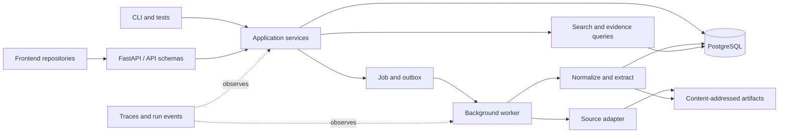

# Backend Architecture

**Status:** controlling Phase 0 implementation direction
**Updated:** 2026-08-19

## Decision

Contour begins as a Python modular monolith with FastAPI, PostgreSQL, and a small durable background worker. Frontend applications live in separate repositories and communicate through versioned HTTP and event/progress contracts.

One deployable may run the API and worker as separate processes, but correctness must not depend on shared process memory. PostgreSQL and content-addressed artifacts hold durable state.



## Architectural rules

1. Domain semantics do not import FastAPI, database clients, provider SDKs, or frontend types.
2. Application services own use-case orchestration and transaction boundaries.
3. API routes validate and translate; they do not contain business rules or query repositories directly.
4. PostgreSQL is the initial operational authority and lexical-search implementation.
5. Raw and large derived artifacts use content addressing; metadata and integrity references live in PostgreSQL.
6. Jobs, retries, cancellation, stages, failures, outputs, and metrics share one observable run lifecycle.
7. Serving indexes and caches are disposable projections rebuildable from authoritative records and artifacts.
8. Vendor-specific types remain inside adapters.
9. Simple deterministic implementations remain the reference until measurement justifies a replacement.

## Proposed package boundaries

The exact filesystem can evolve, but these dependency boundaries are stable:

| Package | Owns | Must not own |
|---|---|---|
| `domain` | identifiers, entities, relationships, evidence, versions, jobs/runs, invariants | HTTP, SQL, provider, or UI details |
| `application` | workspace, source, ingestion, search, entity, evidence, and run use cases | framework sessions or raw SQL |
| `ingest` | source contracts, acquisition, checksums, normalization, incremental decisions | authorization or presentation |
| `extract` | deterministic extraction and bounded typed model outputs later | source truth or human decisions |
| `search` | lexical query, filtering, candidates, ranking contracts | investigation conclusions |
| `runtime` | job/run lifecycle, worker stages, retries, cancellation, checkpoints | domain-specific reasoning |
| `policy` | security context, data classification, egress, and approval decisions | authentication UI |
| `api` | FastAPI schemas, validation, errors, pagination, idempotency, versioning | business rules or direct persistence |
| `adapters` | PostgreSQL, artifacts, sources, and future external providers | durable domain semantics |
| `evaluate` | fixtures, metrics, regression identity, and run comparison | product truth based only on model judges |
| `bootstrap` | executable composition roots, dependency construction, and process lifetimes | business rules or runtime dependency lookup from core code |

Review every change for these dependency directions. Add an automated import
boundary check when the packages contain enough real business code or a
demonstrated regression makes that check more valuable than its maintenance
cost.

## Code organization and request flow

Contour uses ports-and-adapters boundaries with use-case-oriented application
services. Names such as controller, service, repository, model, and DTO describe
responsibilities; they do not require a generic framework base class.

```text
HTTP request
  -> api route/controller + Pydantic request schema
  -> application use-case service + framework-neutral command/query value
  -> behavior-focused port
  -> PostgreSQL/source/artifact adapter
  -> application result
  -> api Pydantic response schema
```

The initial layout applies that flow as follows:

```text
src/contour/
  domain/                 domain objects, value objects, and invariants
  application/            use cases, ports, commands, queries, and results
  adapters/               PostgreSQL, artifact, source, and provider adapters
  api/
    routes/               thin HTTP controllers grouped by resource/capability
    schemas/              Pydantic-only public request/response contracts
    errors.py             application-error to HTTP translation
    app.py                FastAPI assembly from constructed dependencies
  bootstrap.py            process entry points and dependency construction
```

### Namespace and distribution boundary

`src` is the source root, not a second application namespace. Phase 0 ships one
Python distribution and one top-level import package, `contour`; the HTTP
adapter therefore lives at `contour.api`, alongside future peers such as
`contour.cli` or `contour.mcp`. Do not create a generic top-level `api` package
or a second `contour.core` catch-all. Split a delivery adapter into another
distribution only when it has a real independent versioning, ownership, reuse,
or deployment boundary with its own project metadata.

Each new top-level production class has its own capability-named Python file. Keep
package-wide constants, type aliases, and validation helpers in one clearly
named shared module within the owning package. Split existing multi-class
modules when they are materially changed; do not churn stable code solely to
move declarations. Do not create empty `services`, `repositories`,
`controllers`, or `utils` directories in anticipation of growth. FastAPI
routers are Contour's HTTP controllers. Server-rendered views are not part of
this backend.

HTTP, a future CLI, a future MCP server, workers, and tests are peer delivery
adapters. They may translate their own inputs and outputs, but they invoke the
same application services. Application services never call routes, parse HTTP
requests, emit CLI text, or depend on MCP/FastAPI types.

## Model and DTO ownership

One class must not serve all layers merely because the fields initially match:

| Type | Location and representation | Purpose |
|---|---|---|
| Domain model | `domain`; plain typed Python value/entity objects | identity, state, and knowledge invariants |
| Application command/query/result | `application`; plain dataclasses or typed values | transport-neutral use-case input and output |
| API schema | `api/schemas`; Pydantic models | untrusted HTTP validation, serialization, and OpenAPI |
| Persistence model | `adapters/postgres`; SQLAlchemy tables/mappings | SQL schema and database mapping details |

Translate explicitly at a boundary. Reuse an immutable value object across
domain and application only when it retains exactly the same semantics; never
make domain behavior depend on Pydantic, SQLAlchemy, or FastAPI. Migration files
remain the durable schema history and must not import API models.

Repository ports expose behavior needed by a use case or aggregate, such as
`get_workspace` or `add_source_version`; they are not generic CRUD base classes.
PostgreSQL implementations, query expressions, ORM mappings, and row conversion
remain in the adapter. Application services own transaction intent. A
PostgreSQL unit-of-work or transaction adapter will provide the actual atomic
scope when Phase 0.2 introduces state-changing use cases.

## Dependency wiring and lifetimes

Use explicit constructor or function injection and assemble the object graph in
`bootstrap.py`. This is dependency injection without a runtime DI framework:
dependencies are visible to type checking and tests, construction failures
happen at startup, and core packages contain no global service lookup.

- Stateless application services and immutable configuration may be built once
  per process and shared.
- Connection pools, clients, and worker resources are created and closed by an
  explicit application lifespan or context manager.
- Database sessions, transactions, authorization contexts, and request metadata
  are scoped to one request, command, or job; they are never process singletons.
- Factories are injected when a use case needs a fresh scoped resource.
- A dependency registry may be used only at a delivery/composition boundary;
  application and domain code must declare their direct dependencies instead of
  pulling them from a service locator.

FastAPI's dependency mechanism may adapt HTTP request-scoped values, but it is
not the owner of domain or application construction. Adopt a third-party DI
container only if the real graph develops multiple scopes, conditional bindings,
or plugin wiring that manual composition can no longer keep clear. Record the
need, lifecycle and cleanup behavior, simpler alternative, test evidence, and a
removal path before adding that dependency. Singleton support alone is not a
reason to add a container.

## Data ownership

PostgreSQL is authoritative for workspace and source metadata, immutable version manifests, evidence locators, basic entities and relationships, job/run state, search documents, and audit/security metadata appropriate to the current deployment.

Artifact storage is authoritative for acquired bytes, large normalized artifacts, extraction/evaluation outputs, and reproducibility manifests. Every artifact reference includes an integrity digest.

The [knowledge model](knowledge-model.md) controls meaning independently of physical tables.

## Initial application contracts

- create, list, and get workspaces;
- validate, add, list, and get sources;
- start, cancel, and retry ingestion;
- poll or stream job/run progress;
- search admitted content and entities;
- list and get an entity and its basic relationships;
- get evidence and its immutable source version; and
- inspect the run and transformation chain that produced a record.

HTTP handlers, workers, CLI commands, and tests call the same application services. API contracts must be usable without importing Python internals so frontend repositories can generate or maintain independent clients.

## Failure and trust model

Phase 0 handles source preflight failure, timeout, duplicate requests, partial-stage failure, cancellation, retry, worker interruption, corrupt artifacts, checksum mismatch, empty results, unsupported capabilities, invalid credentials/sessions where enabled, and permission denial.

Accepted work survives a failed stage. Retries are idempotent or create an explicit new attempt. Errors and traces redact secrets and never turn a failure into an unexplained empty result.

## Acceptance gate

From a clean environment, the backend must start, migrate an empty database, create a sample workspace, ingest the supported source, survive and recover from a worker interruption, find a known entity, resolve it to exact evidence and a source version, expose its producing run, and reproduce the declared checks in CI.
