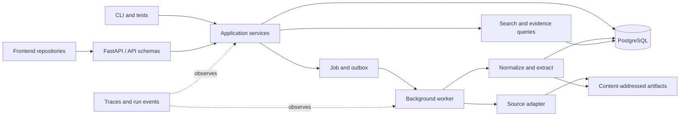

# Backend Architecture

**Status:** controlling Phase 0 implementation direction
**Updated:** 2026-08-19

## Decision

Contour begins as a Python modular monolith with FastAPI, PostgreSQL, and a small durable background worker. Frontend applications live in separate repositories and communicate through versioned HTTP and event/progress contracts.

One deployable may run the API and worker as separate processes, but correctness must not depend on shared process memory. PostgreSQL and content-addressed artifacts hold durable state.

## Architectural rules

1. Domain semantics do not import FastAPI, database clients, provider SDKs, or frontend types.
2. Application services own use-case orchestration and transaction boundaries.
3. API routes validate and translate; they do not contain business rules or query repositories directly.
4. PostgreSQL is the initial operational authority and lexical-search implementation.
5. Raw and large derived artifacts use content addressing; metadata and integrity references live in PostgreSQL.
6. Jobs, retries, cancellation, stages, failures, outputs, and metrics share one observable run lifecycle.
7. Serving indexes and caches are disposable projections rebuildable from authoritative records and artifacts.
8. Vendor-specific types remain inside adapters.
9. Simple deterministic implementations remain the reference until measurement justifies a replacement.

## Proposed package boundaries

The exact filesystem can evolve, but these dependency boundaries are stable:

| Package | Owns | Must not own |
|---|---|---|
| `domain` | identifiers, entities, relationships, evidence, versions, jobs/runs, invariants | HTTP, SQL, provider, or UI details |
| `application` | workspace, source, ingestion, search, entity, evidence, and run use cases | framework sessions or raw SQL |
| `ingest` | source contracts, acquisition, checksums, normalization, incremental decisions | authorization or presentation |
| `extract` | deterministic extraction and bounded typed model outputs later | source truth or human decisions |
| `search` | lexical query, filtering, candidates, ranking contracts | investigation conclusions |
| `runtime` | job/run lifecycle, worker stages, retries, cancellation, checkpoints | domain-specific reasoning |
| `policy` | security context, data classification, egress, and approval decisions | authentication UI |
| `api` | FastAPI schemas, validation, errors, pagination, idempotency, versioning | business rules or direct persistence |
| `adapters` | PostgreSQL, artifacts, sources, and future external providers | durable domain semantics |
| `evaluate` | fixtures, metrics, regression identity, and run comparison | product truth based only on model judges |

Dependency tests should prevent `domain` and `application` from importing infrastructure and delivery frameworks.

## Data ownership

PostgreSQL is authoritative for workspace and source metadata, immutable version manifests, evidence locators, basic entities and relationships, job/run state, search documents, and audit/security metadata appropriate to the current deployment.

Artifact storage is authoritative for acquired bytes, large normalized artifacts, extraction/evaluation outputs, and reproducibility manifests. Every artifact reference includes an integrity digest.

The [knowledge model](knowledge-model.md) controls meaning independently of physical tables.

## Initial application contracts

- create, list, and get workspaces;
- validate, add, list, and get sources;
- start, cancel, and retry ingestion;
- poll or stream job/run progress;
- search admitted content and entities;
- list and get an entity and its basic relationships;
- get evidence and its immutable source version; and
- inspect the run and transformation chain that produced a record.

HTTP handlers, workers, CLI commands, and tests call the same application services. API contracts must be usable without importing Python internals so frontend repositories can generate or maintain independent clients.

## Failure and trust model

Phase 0 handles source preflight failure, timeout, duplicate requests, partial-stage failure, cancellation, retry, worker interruption, corrupt artifacts, checksum mismatch, empty results, unsupported capabilities, invalid credentials/sessions where enabled, and permission denial.

Accepted work survives a failed stage. Retries are idempotent or create an explicit new attempt. Errors and traces redact secrets and never turn a failure into an unexplained empty result.

## Acceptance gate

From a clean environment, the backend must start, migrate an empty database, create a sample workspace, ingest the supported source, survive and recover from a worker interruption, find a known entity, resolve it to exact evidence and a source version, expose its producing run, and reproduce the declared checks in CI.
